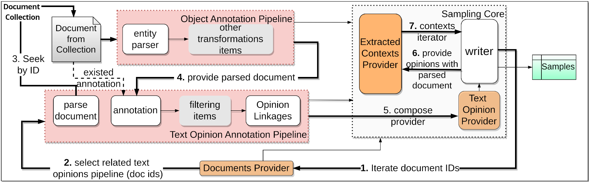

# AREkit 0.25.1


<p align="center">
    
</p>

**AREkit** (Attitude and Relation Extraction Toolkit) --
is a python toolkit, devoted to document level Attitude and Relation Extraction between text objects from mass-media news. 

## Description


This toolkit aims at memory-effective data processing in [Relation Extraction (RE)](https://nlpprogress.com/english/relationship_extraction.html) related tasks.

<p align="center">
    
</p>

> Figure: AREkit pipelines design. More on 
> **[ARElight: Context Sampling of Large Texts for Deep Learning Relation Extraction](https://link.springer.com/chapter/10.1007/978-3-031-56069-9_23)** paper

In particular, this framework serves the following features: 
* ➿ [pipelines](https://github.com/nicolay-r/AREkit/wiki/Pipelines:-Text-Opinion-Annotation) and iterators for handling large-scale collections serialization without out-of-memory issues.
* 🔗 EL (entity-linking) API support for objects, 
* ➰ avoidance of cyclic connections,
* :straight_ruler: distance consideration between relation participants (in `terms` or `sentences`),
* 📑 relations annotations and filtering rules,
* *️⃣ entities formatting or masking, and more.

The core functionality includes: 
* API for document presentation with EL (Entity Linking, i.e. Object Synonymy) support 
for sentence level relations preparation (dubbed as contexts);
* API for contexts extraction;
* Relations transferring from sentence-level onto document-level, and more.

## Installation 

```bash
pip install git+https://github.com/nicolay-r/AREkit.git@0.25.1-rc
```

## Usage

Please follow the **[tutorial section on project Wiki](https://github.com/nicolay-r/AREkit/wiki/Tutorials)** for mode details.

## How to cite
A great research is also accompanied by the faithful reference. 
if you use or extend our work, please cite as follows:

```bibtex
@inproceedings{rusnachenko2024arelight,
  title={ARElight: Context Sampling of Large Texts for Deep Learning Relation Extraction},
  author={Rusnachenko, Nicolay and Liang, Huizhi and Kolomeets, Maxim and Shi, Lei},
  booktitle={European Conference on Information Retrieval},
  year={2024},
  organization={Springer}
}
```
