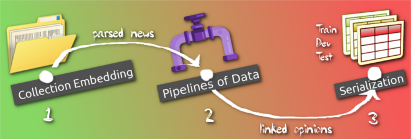

## Tutorials

    

This page lists all the tutorials.

## Input-Sampling Tutorial Journey

    

1. [Binding a custom annotated collection for Relation Extraction
](https://nicolay-r.github.io/blog/articles/2022-08/arekit-collection-bind)
2. [Compose your text-processing pipeline!](https://nicolay-r.github.io/blog/articles/2022-08/arekit-text-parsing-pipeline)
3. [Craft your text-opinion annotation pipeline!](https://nicolay-r.github.io/blog/articles/2022-08/arekit-text-opinion-annotation-pipeline)
4. [Data Foldings](https://nicolay-r.github.io/blog/articles/2022-08/arekit-text-parsing-pipeline)
5. [Frame Variants and Connotation Providers](https://nicolay-r.github.io/blog/articles/2022-09/arekit-frames)
6. [Entity Values Formatting Examples](https://nicolay-r.github.io/blog/articles/2022-09/arekit-entity-formatters-examples)
7. [Sample Mass-Media Text-Opinions for Neural Network](https://nicolay-r.github.io/blog/articles/2022-09/arekit-sampling-networks)
8. [Sample Mass-Media Text-Opinions for BERT](https://nicolay-r.github.io/blog/articles/2022-09/arekit-sampling-bert)
